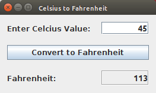
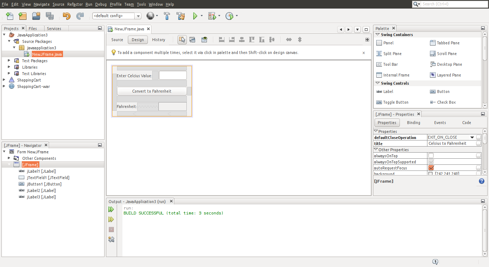
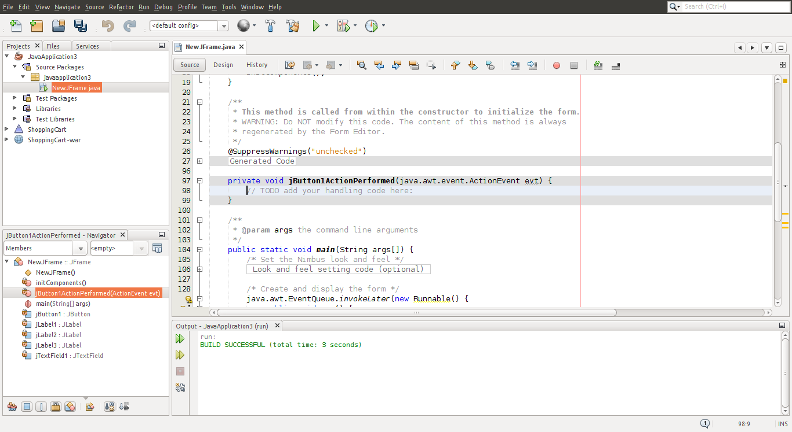
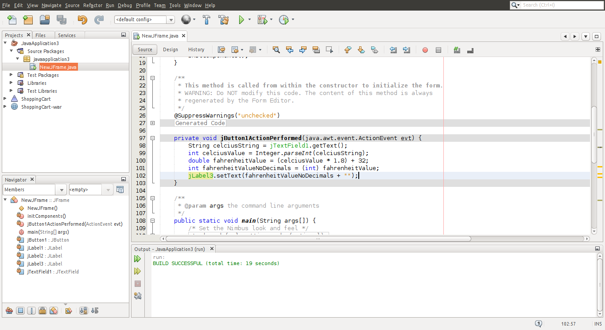
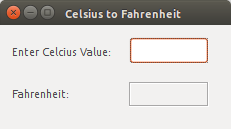

IT Circle
University of Colombo - Faculty of Science

Email: jeewantha.janith@gmail.com

# Swing with NetBeans
---
&nbsp;


&nbsp;

### Let's build a simple Celsius to Fahrenheit converter


*You are going to build this:*



    First, Is your development environment ready?
&nbsp;

    Then, create a new project


*Leave the "Create Main Class" unchecked*


*Now your IDE should look somewhat like this*


    Add a JFrame Form


*This is where you draw your UI*


    Take some time to look around
    Get to know the Design View, Code Editor, Palette and Poperties window
&nbsp;
    
    Now start drawing...



    Let's start coding
    
*But first, add an **Event Handler** to the **Button***





*Use the following lines of code*

```java
String celciusString = jTextField1.getText();
```

```java
int celciusValue = Integer.parseInt(celciusString);
```

```java
double fahrenheitValue = (celciusValue * 1.8) + 32;
```

```java
int fahrenheitValueNoDecimals = (int) fahrenheitValue;
```

```java
jLabel3.setText(fahrenheitValueNoDecimals + "");
```

&nbsp;

*Now, your code should look like this*




    Let's run it

&nbsp;

### Understanding what we just did


*I'll simplify the code a little*

```janith
public class NewClass extends JFrame{
    
    private javax.swing.JButton jButton1;
    private javax.swing.JLabel jLabel1;
    private javax.swing.JLabel jLabel2;
    private javax.swing.JLabel jLabel3;
    private javax.swing.JTextField jTextField1;
                       
    NewClass() {

        jLabel1 = new javax.swing.JLabel();
        jTextField1 = new javax.swing.JTextField();
        jButton1 = new javax.swing.JButton();
        jLabel2 = new javax.swing.JLabel();
        jLabel3 = new javax.swing.JLabel();

        setDefaultCloseOperation(javax.swing.WindowConstants.EXIT_ON_CLOSE);
        setTitle("Celsius to Fahrenheit");
        
        jLabel1.setText("Enter Celcius Value:");
        jTextField1.setFont(new java.awt.Font("Ubuntu", 1, 14));
        jTextField1.setHorizontalAlignment(javax.swing.JTextField.TRAILING);
        
        jLabel2.setText("Fahrenheit:");

        jLabel3.setFont(new java.awt.Font("Ubuntu", 1, 14)); 
        jLabel3.setHorizontalAlignment(javax.swing.SwingConstants.TRAILING);
        jLabel3.setBorder(javax.swing.BorderFactory.createEtchedBorder());

        jButton1.setText("Convert to Fahrenheit");
        
```

*This part is pretty important*

 
```java
        jButton1.addActionListener(new java.awt.event.ActionListener() {
            public void actionPerformed(java.awt.event.ActionEvent evt) {
                jButton1ActionPerformed(evt);
            }
        });
```

*And don't worry about this bunch of code yet*

```java
        javax.swing.GroupLayout layout = new javax.swing.GroupLayout(getContentPane());
        getContentPane().setLayout(layout);
        layout.setHorizontalGroup(
            layout.createParallelGroup(javax.swing.GroupLayout.Alignment.LEADING)
            .addGroup(layout.createSequentialGroup()
                .addContainerGap()
                .addGroup(layout.createParallelGroup(javax.swing.GroupLayout.Alignment.LEADING)
                    .addGroup(layout.createSequentialGroup()
                        .addGroup(layout.createParallelGroup(javax.swing.GroupLayout.Alignment.TRAILING, false)
                            .addGroup(javax.swing.GroupLayout.Alignment.LEADING, layout.createSequentialGroup()
                                .addComponent(jLabel2)
                                .addPreferredGap(javax.swing.LayoutStyle.ComponentPlacement.RELATED, javax.swing.GroupLayout.DEFAULT_SIZE, Short.MAX_VALUE)
                                .addComponent(jLabel3, javax.swing.GroupLayout.PREFERRED_SIZE, 80, javax.swing.GroupLayout.PREFERRED_SIZE))
                            .addGroup(layout.createSequentialGroup()
                                .addComponent(jLabel1)
                                .addGap(18, 18, 18)
                                .addComponent(jTextField1, javax.swing.GroupLayout.PREFERRED_SIZE, 80, javax.swing.GroupLayout.PREFERRED_SIZE)))
                        .addGap(0, 0, Short.MAX_VALUE))
                    .addComponent(jButton1, javax.swing.GroupLayout.Alignment.TRAILING, javax.swing.GroupLayout.DEFAULT_SIZE, javax.swing.GroupLayout.DEFAULT_SIZE, Short.MAX_VALUE))
                .addContainerGap())
        );
        layout.setVerticalGroup(
            layout.createParallelGroup(javax.swing.GroupLayout.Alignment.LEADING)
            .addGroup(layout.createSequentialGroup()
                .addContainerGap()
                .addGroup(layout.createParallelGroup(javax.swing.GroupLayout.Alignment.BASELINE)
                    .addComponent(jLabel1)
                    .addComponent(jTextField1, javax.swing.GroupLayout.PREFERRED_SIZE, javax.swing.GroupLayout.DEFAULT_SIZE, javax.swing.GroupLayout.PREFERRED_SIZE))
                .addGap(18, 18, 18)
                .addComponent(jButton1)
                .addGap(18, 18, 18)
                .addGroup(layout.createParallelGroup(javax.swing.GroupLayout.Alignment.BASELINE)
                    .addComponent(jLabel2, javax.swing.GroupLayout.PREFERRED_SIZE, 25, javax.swing.GroupLayout.PREFERRED_SIZE)
                    .addComponent(jLabel3, javax.swing.GroupLayout.PREFERRED_SIZE, 25, javax.swing.GroupLayout.PREFERRED_SIZE))
                .addContainerGap(javax.swing.GroupLayout.DEFAULT_SIZE, Short.MAX_VALUE))
        );

        pack();
    }                    
```

*This **method** gets called when the button is pressed*

```java
    private void jButton1ActionPerformed(java.awt.event.ActionEvent evt) {                                         
        String celciusString = jTextField1.getText();
        int celciusValue = Integer.parseInt(celciusString);
        double fahrenheitValue = (celciusValue * 1.8) + 32;
        int fahrenheitValueNoDecimals = (int) fahrenheitValue;
        jLabel3.setText(fahrenheitValueNoDecimals + "");
    }                                        
```

*This method is the starting point of the program*

```java
    public static void main(String args[]) {
        new NewJFrame().setVisible(true);
    }
```

&nbsp;

##### Full code here


```java
package javaapplication3;

import java.awt.event.ActionEvent;
import javax.swing.JFrame;

public class NewClass extends JFrame{
    
    private javax.swing.JButton jButton1;
    private javax.swing.JLabel jLabel1;
    private javax.swing.JLabel jLabel2;
    private javax.swing.JLabel jLabel3;
    private javax.swing.JTextField jTextField1;
                       
    NewClass() {

        jLabel1 = new javax.swing.JLabel();
        jTextField1 = new javax.swing.JTextField();
        jButton1 = new javax.swing.JButton();
        jLabel2 = new javax.swing.JLabel();
        jLabel3 = new javax.swing.JLabel();

        setDefaultCloseOperation(javax.swing.WindowConstants.EXIT_ON_CLOSE);
        setTitle("Celsius to Fahrenheit");
        
        jLabel1.setText("Enter Celcius Value:");
        jTextField1.setFont(new java.awt.Font("Ubuntu", 1, 14)); // NOI18N
        jTextField1.setHorizontalAlignment(javax.swing.JTextField.TRAILING);
        
        jLabel2.setText("Fahrenheit:");

        jLabel3.setFont(new java.awt.Font("Ubuntu", 1, 14)); // NOI18N
        jLabel3.setHorizontalAlignment(javax.swing.SwingConstants.TRAILING);
        jLabel3.setBorder(javax.swing.BorderFactory.createEtchedBorder());

        
        jButton1.setText("Convert to Fahrenheit");
        jButton1.addActionListener(new java.awt.event.ActionListener() {
            public void actionPerformed(java.awt.event.ActionEvent evt) {
                jButton1ActionPerformed(evt);
            }
        });
        
        javax.swing.GroupLayout layout = new javax.swing.GroupLayout(getContentPane());
        getContentPane().setLayout(layout);
        layout.setHorizontalGroup(
            layout.createParallelGroup(javax.swing.GroupLayout.Alignment.LEADING)
            .addGroup(layout.createSequentialGroup()
                .addContainerGap()
                .addGroup(layout.createParallelGroup(javax.swing.GroupLayout.Alignment.LEADING)
                    .addGroup(layout.createSequentialGroup()
                        .addGroup(layout.createParallelGroup(javax.swing.GroupLayout.Alignment.TRAILING, false)
                            .addGroup(javax.swing.GroupLayout.Alignment.LEADING, layout.createSequentialGroup()
                                .addComponent(jLabel2)
                                .addPreferredGap(javax.swing.LayoutStyle.ComponentPlacement.RELATED, javax.swing.GroupLayout.DEFAULT_SIZE, Short.MAX_VALUE)
                                .addComponent(jLabel3, javax.swing.GroupLayout.PREFERRED_SIZE, 80, javax.swing.GroupLayout.PREFERRED_SIZE))
                            .addGroup(layout.createSequentialGroup()
                                .addComponent(jLabel1)
                                .addGap(18, 18, 18)
                                .addComponent(jTextField1, javax.swing.GroupLayout.PREFERRED_SIZE, 80, javax.swing.GroupLayout.PREFERRED_SIZE)))
                        .addGap(0, 0, Short.MAX_VALUE))
                    .addComponent(jButton1, javax.swing.GroupLayout.Alignment.TRAILING, javax.swing.GroupLayout.DEFAULT_SIZE, javax.swing.GroupLayout.DEFAULT_SIZE, Short.MAX_VALUE))
                .addContainerGap())
        );
        layout.setVerticalGroup(
            layout.createParallelGroup(javax.swing.GroupLayout.Alignment.LEADING)
            .addGroup(layout.createSequentialGroup()
                .addContainerGap()
                .addGroup(layout.createParallelGroup(javax.swing.GroupLayout.Alignment.BASELINE)
                    .addComponent(jLabel1)
                    .addComponent(jTextField1, javax.swing.GroupLayout.PREFERRED_SIZE, javax.swing.GroupLayout.DEFAULT_SIZE, javax.swing.GroupLayout.PREFERRED_SIZE))
                .addGap(18, 18, 18)
                .addComponent(jButton1)
                .addGap(18, 18, 18)
                .addGroup(layout.createParallelGroup(javax.swing.GroupLayout.Alignment.BASELINE)
                    .addComponent(jLabel2, javax.swing.GroupLayout.PREFERRED_SIZE, 25, javax.swing.GroupLayout.PREFERRED_SIZE)
                    .addComponent(jLabel3, javax.swing.GroupLayout.PREFERRED_SIZE, 25, javax.swing.GroupLayout.PREFERRED_SIZE))
                .addContainerGap(javax.swing.GroupLayout.DEFAULT_SIZE, Short.MAX_VALUE))
        );

        pack();
    }                    

    private void jButton1ActionPerformed(java.awt.event.ActionEvent evt) {                                         
        String celciusString = jTextField1.getText();
        int celciusValue = Integer.parseInt(celciusString);
        double fahrenheitValue = (celciusValue * 1.8) + 32;
        int fahrenheitValueNoDecimals = (int) fahrenheitValue;
        jLabel3.setText(fahrenheitValueNoDecimals + "");
    }                                        

    public static void main(String args[]) {
        new NewJFrame().setVisible(true);
    }

}
```

&nbsp;

### Now, a little more advanced converter

&nbsp;

Let's make the converter more user friendly

Remove the button, so that when you type the Celcius value, It shows the Fahrenheit value realtime

Like this:



&nbsp;
Oh... You'll need this

```java
		int celciusValue = 0;
        try {
            celciusValue = Integer.parseInt(celciusString);  //Risky Code 
        } catch (Exception e) {
            //Something went wrong while converting.
            //So make celciusValue = 0 for convenience
            celciusValue = 0;
        }
```
&nbsp;
This might be better

```java
        int celciusValue = 0;
        try {
            celciusValue = Integer.parseInt(celciusString);  //Risky Code 
            
            double fahrenheitValue = (celciusValue * 1.8) + 32;
            int fahrenheitValueNoDecimals = (int) fahrenheitValue;
            jLabel3.setText(fahrenheitValueNoDecimals + "");
        } catch (Exception e) {
            //Something went wrong while converting.
            //So make celciusValue = 0 for convenience
            jLabel3.setText("Invalid Input");
        }
```

&nbsp;

### That's it!

&nbsp;

&nbsp;

&nbsp;

&nbsp;

##### Use the knowledge and try to build a calculator
###### (See the second image on the top)

&nbsp;

&nbsp;

&nbsp;

&nbsp;

## Thank You


